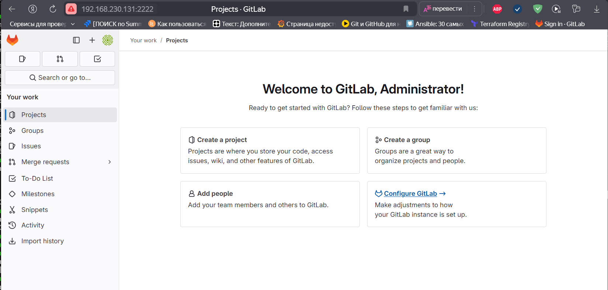
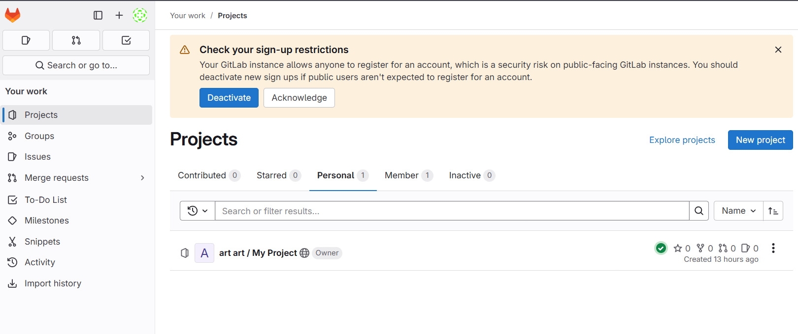
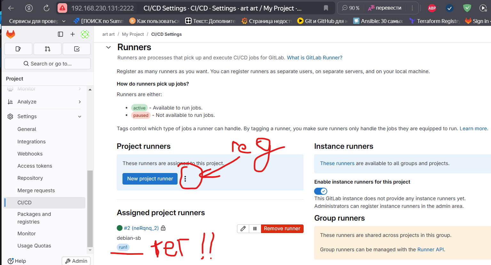
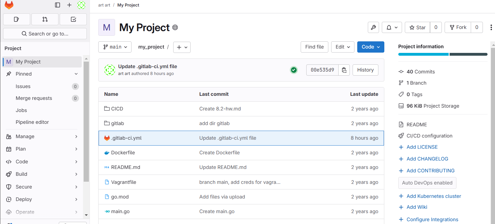
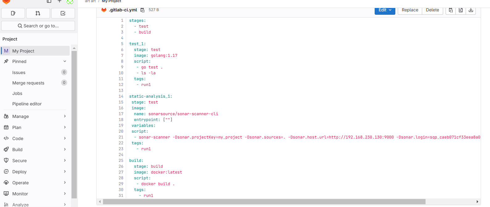
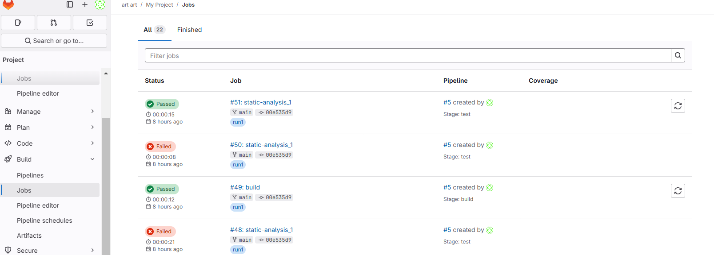

*Задание 1*
Что нужно сделать:

1. Разверните GitLab локально, используя Vagrantfile и инструкцию, описанные в этом репозитории.
[gitlab](https://github.com/htment/HOMEWORK_GITLAB/tree/main/GITLAB_INSTALL)

2. Cоздайте новый проект и пустой репозиторий в нём.

3. Зарегистрируйте gitlab-runner для этого проекта и запустите его в режиме Docker. Раннер можно регистрировать и запускать на той же виртуальной машине, на которой запущен GitLab.
В качестве ответа в репозиторий шаблона с решением добавьте скриншоты с настройками раннера в проекте.

*Задание 2*
Что нужно сделать:

1. Запушьте репозиторий на GitLab, изменив origin. Это изучалось на занятии по Git.
Создайте .gitlab-ci.yml, описав в нём все необходимые, на ваш взгляд, этапы.

2. В качестве ответа в шаблон с решением добавьте:
файл gitlab-ci.yml для своего проекта или вставьте код в соответствующее поле в шаблоне;
скриншоты с успешно собранными сборками.

